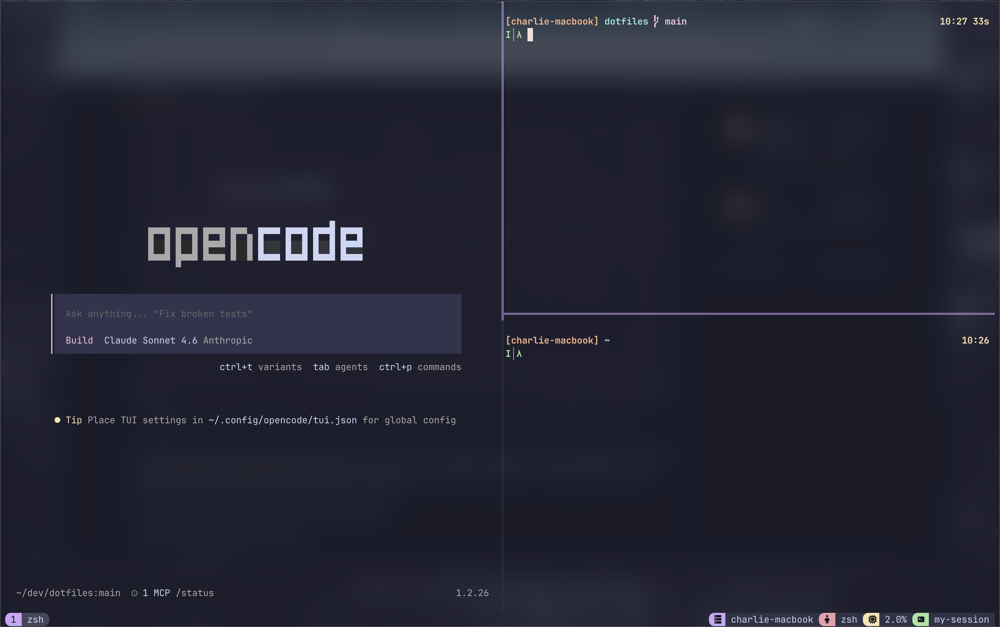

# dotfiles



> **Warning**: The recommended flow is to fork the repo and make any updates you may want. Use at your own risk!

My personal dotfiles for MacOS, managed with [GNU Stow](https://www.gnu.org/software/stow/). As this config was setup to transition myself from IDEs to terminal-first development and get ramped up on VIM motions as quickly as possible, I've purposefully removed bindings for the arrow keys. Feel free to edit as you see fit.

See [Keybindings.md](Keybindings.md) for a full reference of all bindings.

## What's included

- **zsh** — shell configuration
- **tmux** — terminal multiplexer
- **starship** — shell prompt
- **neovim** — editor (based on [my fork](https://github.com/cckelly/kickstart.nvim) of Kickstart)
- **ghostty** — terminal emulator
- **Brewfile** — Homebrew packages, casks, and taps
- **OpenCode** - Open source coding agent

## Install

```bash
git clone https://github.com/cckelly/dotfiles.git /path/to/dotfiles && /path/to/dotfiles/install.sh
```

This will install Homebrew if it doesn't exist, install all packages from Brewfile and symblink the configs to their correct home directory locations via `stow`.

## Updating

Since configs are symlinked, any edits to files like `~/.zshrc` directly update the repo file and vice versa.

If you made brew changes, you can update your Brewfile like so:

```bash
brew bundle dump --file=/path/to/dotfiles/Brewfile --force
```

Then push any changes to your forked version and pull the changes on any machine you want to sync your config on.
